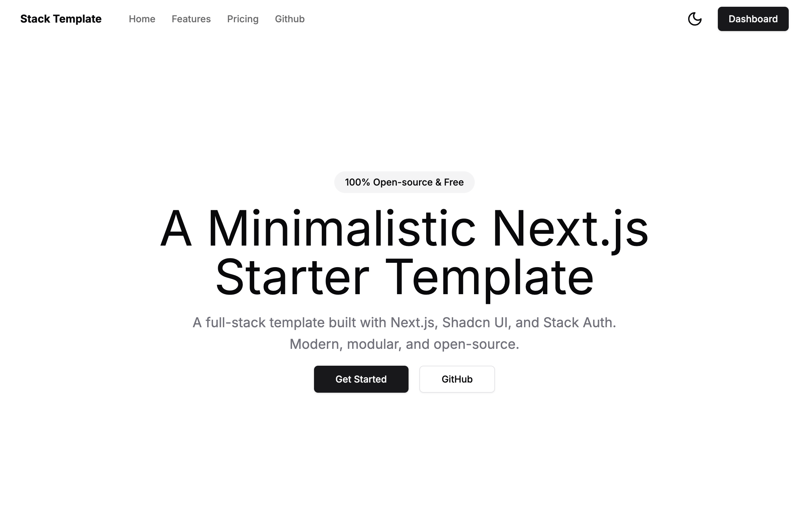
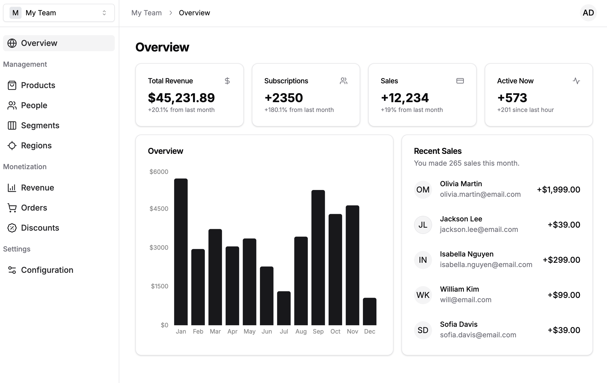

# Stack Template
A minimalistic Next.js starter template. Minimum setup, modular design, bring your own backend and database.

## Landing Page

## Dashboard

## Features & Tech Stack

- Next.js 14 app router
- TypeScript
- Tailwind & Shadcn UI
- Stack Auth
- Multi-tenancy (teams/orgs)
- Dark mode

## Inspired by

- [Shadcn UI](https://github.com/shadcn-ui/ui)
- [Shadcn Taxonomy](https://github.com/shadcn-ui/taxonomy)